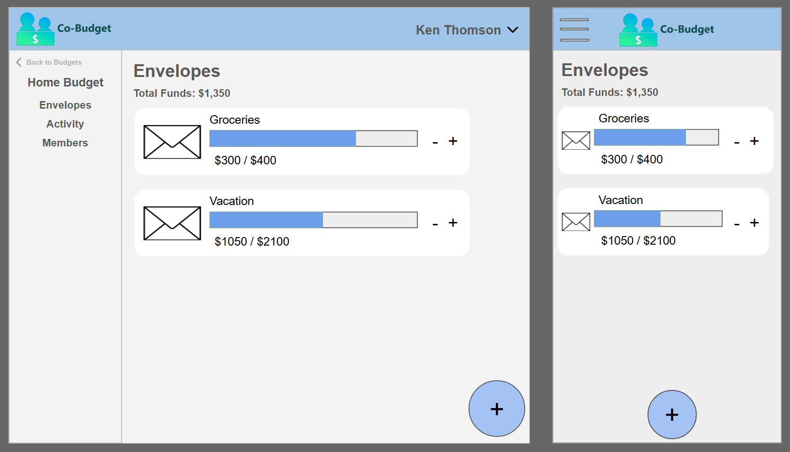
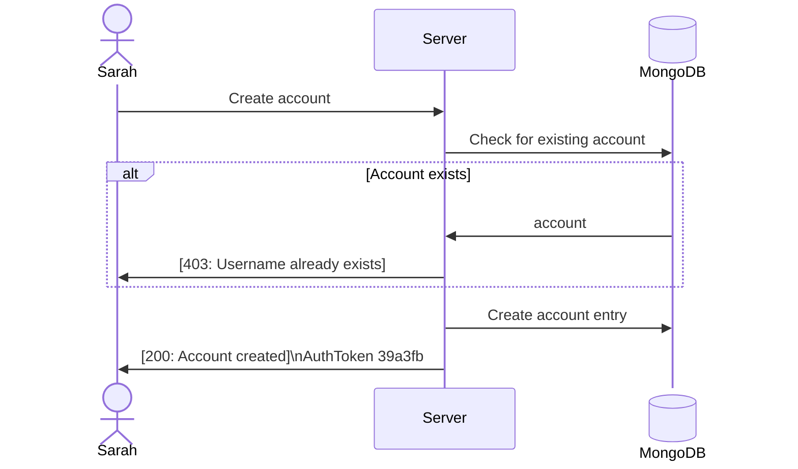
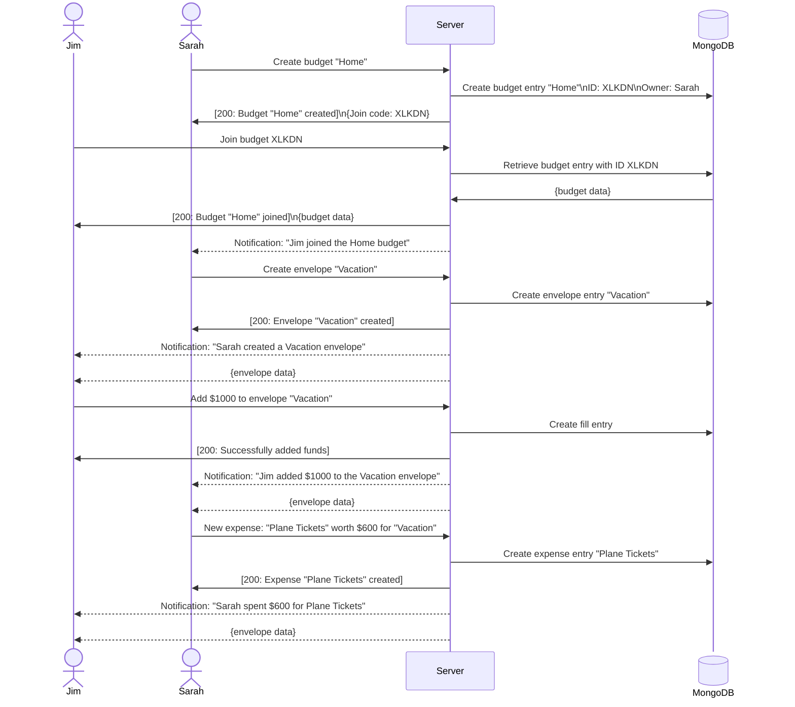

# ngCo-Budget

[My Notes](notes.md)

Co-Budget is a shared budget application built for families and couples to collaboratively track expenses and manage group budgets.

### Elevator pitch

Have you ever made a budget, but then someone else in the family spent money without telling you? 

**Co-Budget** is a shared budget application built for families and couples to collaboratively track expenses and manage group budgets. 

Users can create budgets, add funds, and track expenses together. Users within the same budget can see when other people spend money. 

With **Co-Budget**, everyone can stay on the same page when it comes to family finances!

### Design

The sketch above is rudimentary, but it shows the basic idea of the application. A user will have multiple budgets, and each budget will have multiple envelopes. Envelopes are the containers for the money. Users can add money to envelopes, and they can spend money from envelopes. 

Users can see when other people (even in real time thanks to websockets):

- Join a budget
- Add money to envelopes
- Spend money from envelopes
- Create new envelopes
- Delete envelopes

Below are a few diagrams to show the flow of the application. Not all features are shown, but a select handful are.

### Account Creation Diagram

### Co-Budget Diagram

Dashed arrows indicate Websocket asynchronous communication.

AuthTokens will be used to authenticate users who are logged in. For conciseness, AuthTokens and verification are not mentioned in this diagram.

### Key features

- Secure account creation and login
- Adding labelled envelopes to organize total funds
- Filling envelopes and tracking expenses
- Cloud-based sync and budget sharing
- Real-time updates for all users
- QR Code sharing to allow users to join a budget without having to enter the join code

### Technologies

I am going to use the required technologies in the following ways.

- **HTML** - Uses HTML to structure the pages. There will be several pages, including login, budget selection, envelope management, and activity tracking, to name a few. Images, links, and text will be used to create the initial pages.
- **CSS** - Uses CSS to style the pages. Styles will remain consisten throughout the application. Flexbox and grid will be used to create the layout of the pages.
- **React** - Uses React to service the login menu, popup menus (e.g. "New Transaction"), navigation, and dropdown menus. 
- **Service** - Uses a server to host the application's backend logic. Used for login, registration, budget creation, joining budgets, adding funds, and more.
- **DB/Login** - Uses MongoDB to store user accounts and login information. Credentials securely stored in the database. Budgets, envelopes, and history are stored in the database.
- **WebSocket** - Uses WebSocket to send and receive real-time updates to all users in a budget. This is used to notify users when other people join a budget, add funds to an envelope, spend money from an envelope, create a new envelope, or delete an envelope.

## 🚀 Specification Deliverable

[example](https://github.com/webprogramming260/startup-example/blob/main/README.md)

For this deliverable I did the following. I checked the box `[x]` and added a description for things I completed.

- [x] I completed the prerequisites for this deliverable (Git commit requirement)
- [x] Proper use of Markdown
- [x] A concise and compelling elevator pitch
- [x] Description of key features
- [x] Description of how you will use each technology including your 3rd party API and use of WebSocket
- [x] One or more rough sketches of your application. Images must be embedded in this file using Markdown image references.

## 🚀 AWS deliverable

For this deliverable I did the following. I checked the box `[x]` and added a description for things I completed.

- [ ] **Rented EC2 server** - I did not complete this part of the deliverable.
- [ ] **Leased domain name** - I did not complete this part of the deliverable.
- [ ] **Server accessible** from my domain: [https://yourdomainnamehere.click](https://yourdomainnamehere.click) - I did not complete this part of the deliverable.

## 🚀 HTML deliverable

For this deliverable I did the following. I checked the box `[x]` and added a description for things I completed.

- [ ] I completed the prerequisites for this deliverable (Simon deployed, GitHub link, Git commits)
- [ ] **HTML pages** - I did not complete this part of the deliverable.
- [ ] **Proper HTML element usage** - I did not complete this part of the deliverable.
- [ ] **Links** - I did not complete this part of the deliverable.
- [ ] **Text** - I did not complete this part of the deliverable.
- [ ] **3rd party API placeholder** - I did not complete this part of the deliverable.
- [ ] **Images** - I did not complete this part of the deliverable.
- [ ] **Login placeholder** - I did not complete this part of the deliverable.
- [ ] **DB data placeholder** - I did not complete this part of the deliverable.
- [ ] **WebSocket placeholder** - I did not complete this part of the deliverable.

## 🚀 CSS deliverable

For this deliverable I did the following. I checked the box `[x]` and added a description for things I completed.

- [ ] I completed the prerequisites for this deliverable (Simon deployed, GitHub link, Git commits)
- [ ] **Visually appealing colors and layout. No overflowing elements.** - I did not complete this part of the deliverable.
- [ ] **Use of a CSS framework** - I did not complete this part of the deliverable.
- [ ] **All visual elements styled using CSS** - I did not complete this part of the deliverable.
- [ ] **Responsive to window resizing using flexbox and/or grid display** - I did not complete this part of the deliverable.
- [ ] **Use of a imported font** - I did not complete this part of the deliverable.
- [ ] **Use of different types of selectors including element, class, ID, and pseudo selectors** - I did not complete this part of the deliverable.

## 🚀 React part 1: Routing deliverable

For this deliverable I did the following. I checked the box `[x]` and added a description for things I completed.

- [ ] I completed the prerequisites for this deliverable (Simon deployed, GitHub link, Git commits)
- [ ] **Bundled using Vite** - I did not complete this part of the deliverable.
- [ ] **Components** - I did not complete this part of the deliverable.
- [ ] **Router** - I did not complete this part of the deliverable.

## 🚀 React part 2: Reactivity deliverable

For this deliverable I did the following. I checked the box `[x]` and added a description for things I completed.

- [ ] I completed the prerequisites for this deliverable (Simon deployed, GitHub link, Git commits)
- [ ] **All functionality implemented or mocked out** - I did not complete this part of the deliverable.
- [ ] **Hooks** - I did not complete this part of the deliverable.

## 🚀 Service deliverable

For this deliverable I did the following. I checked the box `[x]` and added a description for things I completed.

- [ ] I completed the prerequisites for this deliverable (Simon deployed, GitHub link, Git commits)
- [ ] **Node.js/Express HTTP service** - I did not complete this part of the deliverable.
- [ ] **Static middleware for frontend** - I did not complete this part of the deliverable.
- [ ] **Calls to third party endpoints** - I did not complete this part of the deliverable.
- [ ] **Backend service endpoints** - I did not complete this part of the deliverable.
- [ ] **Frontend calls service endpoints** - I did not complete this part of the deliverable.
- [ ] **Supports registration, login, logout, and restricted endpoint** - I did not complete this part of the deliverable.
- [ ] **Uses BCrypt to hash passwords** - I did not complete this part of the deliverable.

## 🚀 DB deliverable

For this deliverable I did the following. I checked the box `[x]` and added a description for things I completed.

- [ ] I completed the prerequisites for this deliverable (Simon deployed, GitHub link, Git commits)
- [ ] **Stores data in MongoDB** - I did not complete this part of the deliverable.
- [ ] **Stores credentials in MongoDB** - I did not complete this part of the deliverable.

## 🚀 WebSocket deliverable

For this deliverable I did the following. I checked the box `[x]` and added a description for things I completed.

- [ ] I completed the prerequisites for this deliverable (Simon deployed, GitHub link, Git commits)
- [ ] **Backend listens for WebSocket connection** - I did not complete this part of the deliverable.
- [ ] **Frontend makes WebSocket connection** - I did not complete this part of the deliverable.
- [ ] **Data sent over WebSocket connection** - I did not complete this part of the deliverable.
- [ ] **WebSocket data displayed** - I did not complete this part of the deliverable.
- [ ] **Application is fully functional** - I did not complete this part of the deliverable.